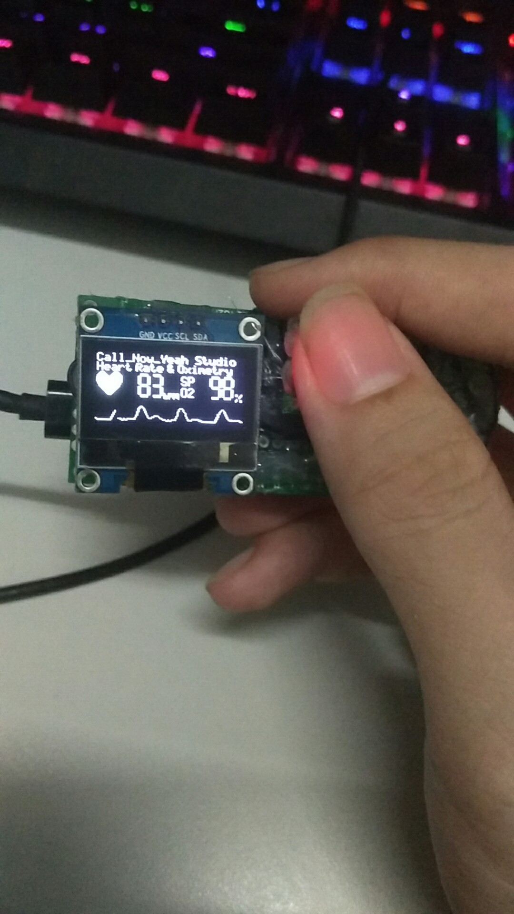
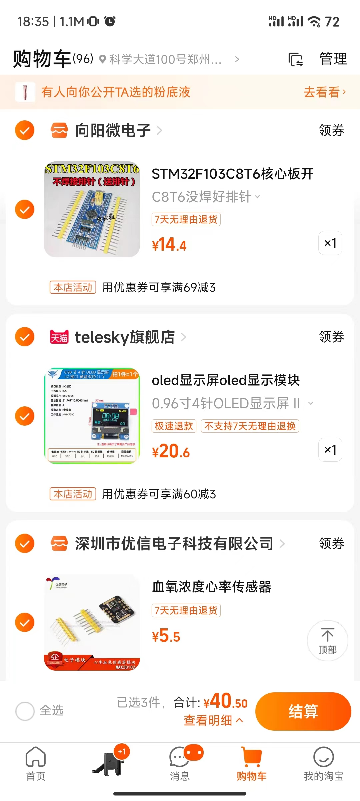

# stm32f103c8t6 max30102 with oled screen

- project creat by stm32cubemx

MCU IO | connect to
---|---
PA0(WAKE) | button for run and sleep
PB6(I2C1_SCL) | oled screen SCL
PB7(I2C1_SDA) | oled screen SDA
PB10(I2C2_SCL) | max30102 SCL
PB11(I2C2_SDA) | max30102 SDA
PB12 | max30102 interrupt
PC13 | led light

1. The heart rate calculation way is not very good and waste a lot ram. But it works, so...whatever.
2. I use the infrared brightness data to calculate the heart rate, so if your finger is cold, it can't work well. You can use the red light data to calculate by changing "sampleBuffTemp[i].iRed" to "sampleBuffTemp[i].Red" (line 221 and 238 in file max30102.c).
3. The max30102 module I bought it from the internet. The pull-up resistors are connect to 1.8v and the I2C bus instability. So if you encounter the same situation, just kick them off and pull-up those pin to 5v or 3.3v on the other way.

---

1. 心率计算方式写得不是很严谨，而且占不少内存，反正它能用，无所谓啦。
2. 计算心率用的是红外的数据，所以当你的手指比较冷的时候它是测不出来的。你可以把max30102.c文件里第221、238行的 sampleBuffTemp[i].iRed 改成 sampleBuffTemp[i].Red，用红光数据，虽然这样也不怎么测得出。
3. max30102是从淘宝买的模块，它引脚的上拉电阻只是接到了1.8v，所以如果你也是用那种模块，请把它自带的上拉电阻抠掉，另外上拉到5v或3.3v。

---

---

参考了以下两篇论文  
Reference these two paper

1. [血氧饱和度检测技术研究-方启超](http://kns.cnki.net/KCMS/detail/detail.aspx?dbcode=CMFD&dbname=CMFD201302&filename=1013166432.nh&uid=WEEvREcwSlJHSldRa1FhdkJkVWI2cEg1MXdhY3ZWejRHVGZ0NDFhZ3RyRT0=$9A4hF_YAuvQ5obgVAqNKPCYcEjKensW4ggI8Fm4gTkoUKaID8j8gFw!!&v=MDkwMTFQclpFYlBJUjhlWDFMdXhZUzdEaDFUM3FUcldNMUZyQ1VSTEtmWmVacUZDdmxXcnpJVkYyNkhiSytHTlg=) 
2. [基于C8051F021单片机的脉搏血氧饱和度测量仪的研制](http://kns.cnki.net/KCMS/detail/detail.aspx?dbcode=CMFD&dbname=CMFD2010&filename=2009213547.nh&uid=WEEvREcwSlJHSldRa1FhdkJkVWI2cEg1MXdhY3ZWejRHVGZ0NDFhZ3RyRT0=$9A4hF_YAuvQ5obgVAqNKPCYcEjKensW4ggI8Fm4gTkoUKaID8j8gFw!!&v=MTgxNzdick9WMTI3RjdHNUhkVElxSkViUElSOGVYMUx1eFlTN0RoMVQzcVRyV00xRnJDVVJMS2ZaZVpxRkN2bFY=)

---

callnowyeah@yeah.net

